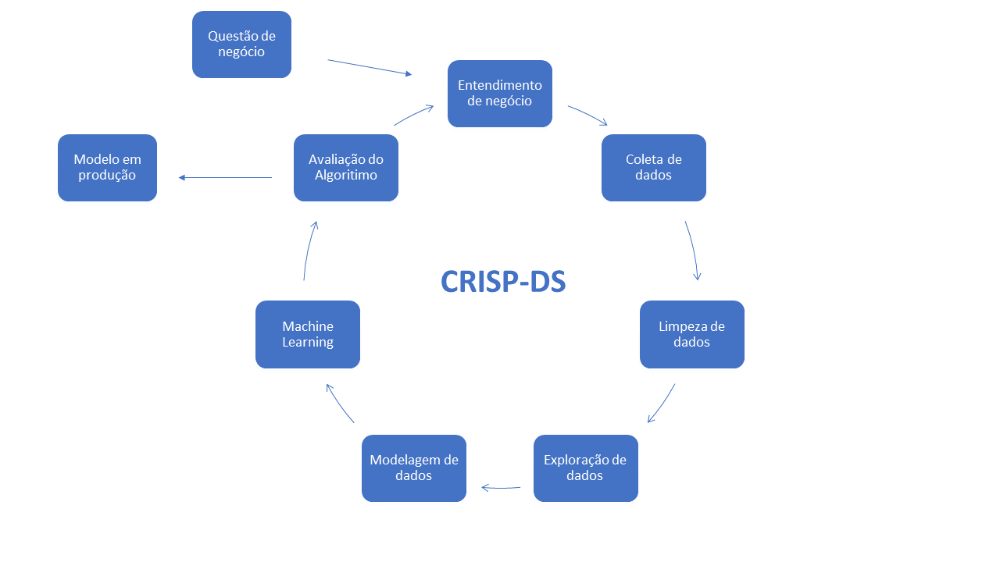
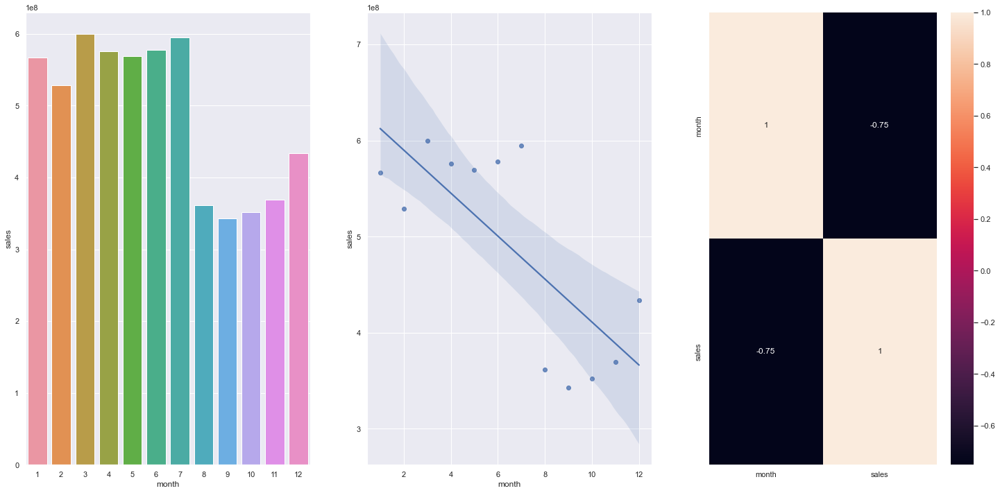
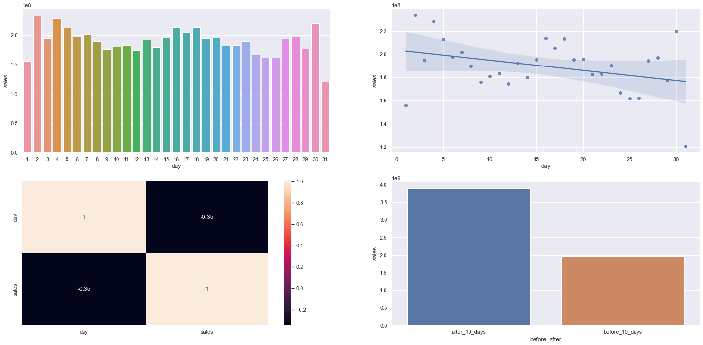
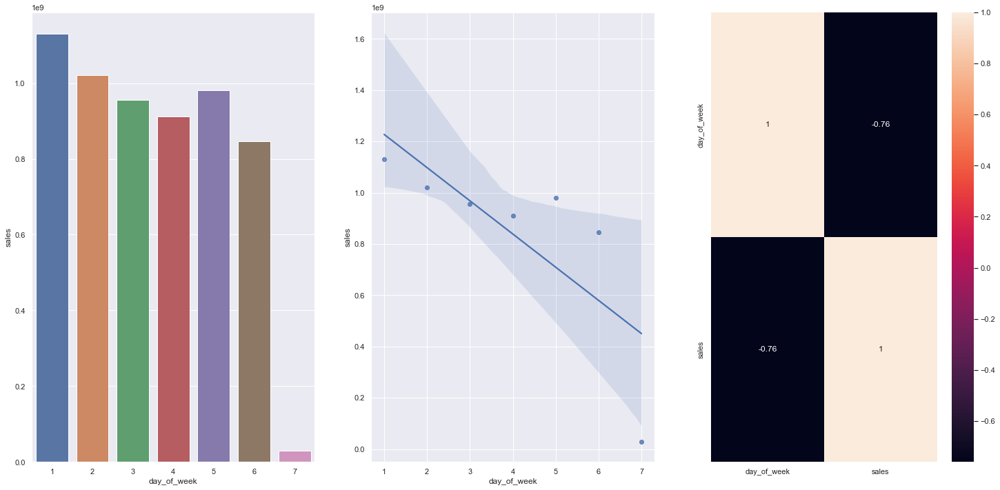
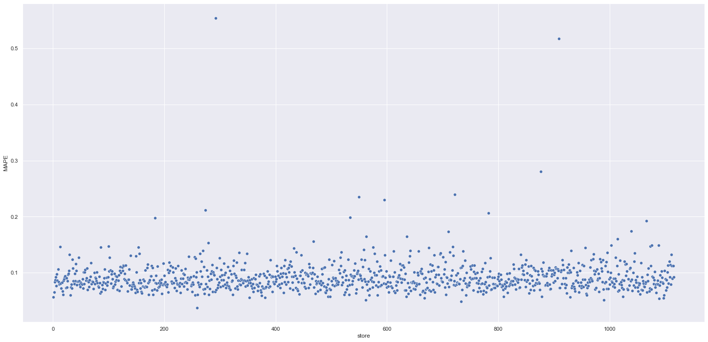
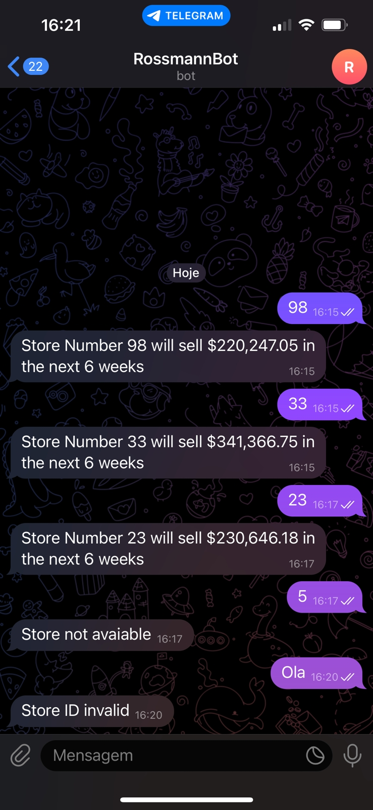
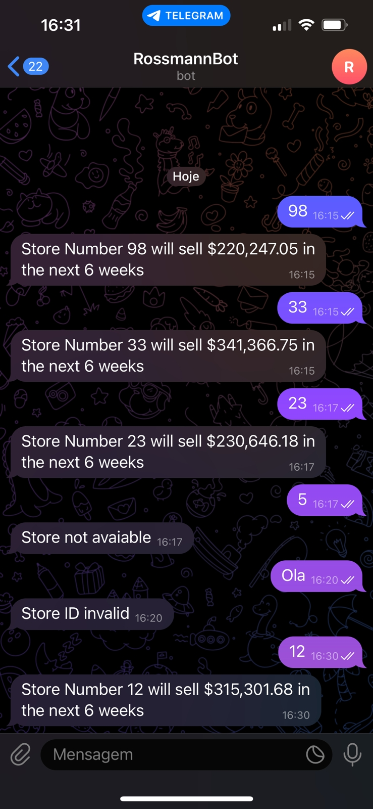

# 
 Rossmann Store -  Previsão de Vendas  

## 1. Problema de Negócio:

A Rossmann é uma das maiores redes de drogarias da Europa. Atualmente possui mais de 56000 funcionários em mais de 4000 lojas.

O CFO da empresa pretende reformar as lojas da rede de farmácias com o intuito de atender seus clientes. Para tanto, ele necessita que os gerentes das lojas enviem a previsão de receita das próximas 6 semanas para que ele provisione o valor que será investido em cada loja no processo de reforma.

Atualmente esses valores são calculados de forma individual, sendo o gerente de cada loja o responsável pela entrega dessas previsões. As vendas de cada unidade são influenciadas por diversos fatores entre eles: promoções, localização, concorrência, sozonalidade. Isso faz com que os resultados sejam bastante variados, se tornando assim um grande desafio para a rede.

Dessa forma, esse projeto tem como objetivo auxiliar o CFO na tomada de decisão, provendo as previsões de faturamento de cada loja de forma automática e possibilitando que o mesmo tenha acesso as previsões através de um Bot do aplicativo Telegram.

## 2. Descrição dos dados:

Foi disponibilizada pela empresa os dados dentro da plataforma de competições de dados [Kaggle](https://www.kaggle.com/competitions/rossmann-store-sales/overview). Os dados apresentam 1.017.209 registros das vendas realizadas pelas filiais da empresa, contendo 18 características únicas para cada venda realizada conforme listado abaixo:

| Atributo                          | Descrição                                                                                                                                             |
| :-------------------------------- | :---------------------------------------------------------------------------------------------------------------------------------------------------- |
| Store                             | Identificador único de cada loja                                                                                                                      |
| DayOfWeek                         | Variável numérica que representa o dia da semana                                                                                                                  |
| Date                         		| Data em que ocorreu a venda                                                                                                    |
| Sales                             | Valor de vendas do dia                                                                                                                                |
| Customers                         | Quantidade de clientes na loja no dia                                                                                                                 |
| Open                              | Indicador para loja:  1 = Aberta, 0 = Fechada                                                                                                         |
| Promo                             | Indica se a loja está com alguma promoção ativa no dia                                                                                                |
| StateHoliday                      | Indica se o dia é feriado. (a = Feriado público, b = Feriado de páscoa, c = Natal, 0 = Não há feriado)                                        |
| SchoolHoliday                     | Indica se a loja foi ou não fechada durante o feriado escolar                                                                                         |
| StoreType                         | Indica o modelo de lojas. Pode variar entre a, b, c, d                                                                                                |
| Assortment                        | Indica o nível de variedade de produtos: a = básico, b = extra, c = estendido                                                                         |
| CompetitionDistance               | Distância (em metros) para o concorrente mais próximo                                                                                                  |
| CompetitionOpenSince [Month/Year] | Indica o ano e mês em que o concorrente mais próximo abriu                                                                                             |
| Promo2                            | Indica se a loja deu continuidade na promoção: 0 = não está participando, 1 = participando                                                  |
| Promo2Since [Year/Week]           | Indica o ano e semana de quando a loja começa a promoção extendida                                                                                |
| PromoInterval                     | Indica os meses em que a loja iniciou a promo2, ex.: "Jan,Apr,Jul,Oct" significa que a loja iniciou as promoções estendidas em cada um desses meses |

## 3. Estratégia de Solução:

Para desenvolvimento da solução utilizei um processo de modelagem chamado CRISP-DS. Sua natureza cíclica permite não só a refatoração do código como também a formulação de outras hipóteses e melhora dos modelos ao longo de cada ciclo.

## Passos do CRISP-DS:
1. **Questão de Negócio:** Esta etapa tem como objetivo receber o problema de negócio a ser executado.

2. **Entendimento de Negócio:** Esta etapa concentra-se na compreensão dos objetivos e requisitos do projeto. Entender o problema de uma perspectiva de negócio é fundamental para sucesso do projeto.

3. **Coleta de Dados:** Realizar a coleta dos dados. Para esse projeto foi disponibilizado os dados em formato .CSV.

4. **Limpeza dos Dados:** Esta etapa tem como objetivo remover todo e qualquer dado que não seja relevante para o modelo, tomando o cuidado e entender bem o fenômeno que está sendo estudado para que não sejam removidos dados importantes para a modelagem do problema.

5. **Exploração dos Dados:** Esta etapa tem como objetivo entender os dados e qual a relação entre eles. Normalmente, são criadas hipóteses que posteriormente serão validadas utilizando técnicas de análise de dados. É nessa etapa que serão criadas novas *features* que serão utilizadas na etapa de Modelagem de Dados.

6. **Modelagem dos Dados:** Esta etapa tem como objetivo preparar os dados para que eles sejam utilizados pelos algoritmos de Machine Learning. É nesta etapa que são feitas as transformações e *encodign* dos dados, a fim de facilitar o aprendizado do algoritmo utilizado.

7. **Machine Learning:** Esta etapa tem como objetivo selecionar e aplicar algoritmos de Machine Learning nos dados preparados nas etapas anteriores. Aqui tambem são selecionados os algoritmos e feita a comparação de performance enetre eles, para selecionar o algoritmos que melhor performou como algoritmo final.

8. **Avaliação do Algoritimo:** Esta etapa tem como objetivo verificar a performance do algoritmo selecionado na etapa anterior com os resultados atuais. Neste momento é feita a tradução da performance do algoritmo para perfomance de negócio. Ou seja, quanto a solução criada trará de retorno financeiro para a empresa. Caso a performance seja aceitável, o algoritmo é publicado e entra em produção, caso contrário o mesmo retorna para a etapa de entendimento de negócio para um novo ciclo, a fim de melhorar a performance da solução.

9. **Modelo em produção:** Esta etapa tem como objetivo publicar o algoritmo selecionado, deixando público e acessível para tomada de decisão.

## 4. EDA Insights

## 1: Lojas deveriam vender mais no segundo semestre do ano

**Hipótese Falsa:** Lojas vendem MENOS no segundo semestre do ano

## 2: Lojas deveriam vender mais depois do dia 10 de cada mês.

**Hipótese Verdadeira:** Lojas vendem MAIS depois do dia 10 de cada mês.

## 3: Lojas deveriam vender MENOS aos finais de semana.

**Hipótese Verdadeira:** Lojas vendem menos no final de semana

# 5. Modelos de Machine Learning

## 5.1 Métrica:

A métrica de avaliação escolhida foi a MAPE (Mean Absolute Percentage Error), que representa a porcentagem do erro em relação ao valor médio.

Na primeira parte da etapa foi realizado a avaliação simples do modelo (Single Performance) onde o modelo Random Forest performou melhor.

## 5.2 Resultados:

### Single Performance:

| Model Name | MAE | MAPE | RMSE |
|  --- | --- | --- | --- |
| Random Forest Regressor | 679.598831 | 0.099913 | 1011.119437|
| Average Model	 | 1354.800353 | 0.206400 | 1835.135542|
| Linear Regression | 1867.089774 |0.292694 | 2671.049215 |
| Linear Regression - Lasso | 1891.704881 | 0.289106| 2744.451737 |
| XGBoost Regressor | 6683.423528 | 0.949439 | 7330.693347 |

Mesmo o modelo XGBoost não performando com um resultado aceitável no primeiro momento, após a etapa de *Hyperparameter fine tuning* onde foram ajustados os parâmetros, o modelo apresentou bons resultados. A escolha deste modelo também foi baseada no tempo de processamento do algoritmo, que é muito menor que o Random Forest, significando redução de custos de processamento e cloud.

### Cross Validation Performance:

| Model Name | MAE | MAPE | RMSE |
|  --- | --- | --- | --- |
| XGBoost Regressor | 650.631529 | 0.095503 | 944.394141 |

# 6. Resultado Final

O resultado final foi muito satisfatório, apenas um pequeno grupo destoou na previsão em relação aos demais e precisára de ajustes nos proximos ciclos. A maior parte das lojas tiveram o erro MAPE muito próximo do erro performado no modelo que foi de 9%.

O resultado final do modelo, considerarando o pior e o melhor cenário, é o seguinte:

| Cenários       |    Valores        |
| :------------- | ----------------: |
| Previsão Feita | \$ 285.645.120,00 |
| Pior Cenário   | \$ 284.915.711,74 |
| Melhor Cenário | \$ 286.374.532,85 |

# 7. Deploy

Conforme descrito no inicio do projeto, o deploy do modelo ficara disponivel via Telegram.

Para ter acesso as previsões, basta seguir os passos abaixo:

- Criar uma conta no Telegram;
- Fazer o download do app Telegram em seu celular, ou utilizar o telegram web.

Segue link para acesso do telegram Bot:

Previsões em tempo real:

- Enviar o número da loja que deseja receber a previsão de faturamento das próximas 6 semanas:

Possíveis problemas:

- Caso o número da loja nao esteja cadastrada na base de dados, o bot ira retornar com a mensagem 'Store not avaiable'

- Caso sejam informados caracteres diferentes de números, o bot irá retornar com a mensagem 'Store ID invalid'

Caso isso venha a ocorrer, informe novo número para consulta.

# 8. Conclusão

O projeto foi entregue conforme o planejado. Os dados estão disponíveis e acessíveis em tempo real para que a informação ajude na melhor tomada de decisão.

O deploy do modelo foi hospedado de forma **gratuita** na cloud do [Render](https://render.com/)

Todas as etapas do projeto podem ser consultadas dentro deste repositório.

# 9. Próximos Passos

- Iniciar um novo ciclo do **CRISP** e identificar possíveis melhorias.
- Utilizar nova abordagem no tratamento de dados faltantes.
- Investigar a razão de algumas lojas estarem com previsões acima do MAPE do modelo.
- Criar novas features afim de melhorar a performance do modelo.
- Disponibilizar os dados através de um aplicativo WEB, para que mais pessoas tenham acesso as previsões.
- Treinar novos modelos de ML.

